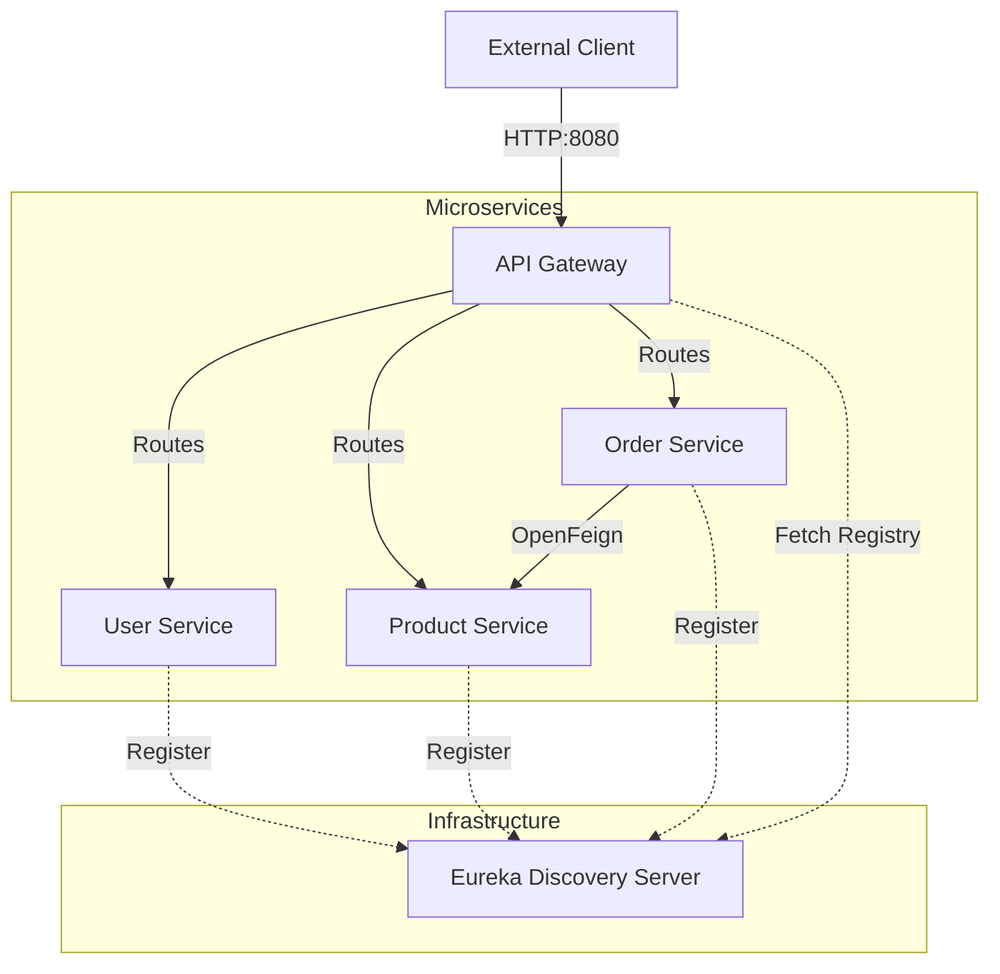

# Microservices Starter Kit

A modern, cloud-native distributed system architecture built with **Java 21** and **Spring Boot 3.5**.
This project demonstrates a production-ready microservices foundation featuring Service Discovery, API Gateway Routing, and Inter-service communication using OpenFeign.

[](https://github.com/stefanobini99/microservices-starter-kit/actions/workflows/maven.yml)


## Architecture

The system follows the **API Gateway pattern**. All external traffic flows through the Gateway, which handles routing to internal services. Services register dynamically with Eureka and communicate synchronously via OpenFeign.



## Tech Stack
- **Core:** Java 21, Spring Boot 3.5.8
- **Discovery:** Netflix Eureka Server
- **Routing:** Spring Cloud Gateway (Reactive)
- **Communication:** OpenFeign (Declarative REST Client)
- **Database:** H2 In-Memory (Simulating independent DBs per service)
- **Tooling:** Maven (Multi-Module), Docker, Docker Compose, Lombok

## Services
| Service              | Port | Description                              |
|----------------------|------|------------------------------------------|
| **Discovery Server** | `8761` | Service Registry (Eureka)                |
| **API Gateway**      | `8080` | Single Entry Point & Routing             |
| **User Service**     | `8081` | User Management                          |
| **Product Service**  | `8082` | Product Catalog Inventory                |
| **Order Service**    | `8083` | Order Processing (Calls Product Service) |

## Getting Started
### Prerequisites
- Java 21 SDK
- Maven 3.8+
- Docker (Optional)

### Option 1: Run with Docker (Recommended)
This spins up the entire fleet (Registry, Gateway, and all Microservices) in orchestrated containers.
```bash
  docker-compose up -d --build
```

### Option 2: Run Locally (Manual)
You must start the services in this specific order to ensure registration works immediately (though they are resilient enough to retry).
1) Discovery Server:
```bash
    mvn spring-boot:run -pl discovery-server
``` 
2) Product Service:
```bash
    mvn spring-boot:run -pl product-service
``` 
3) User Service:
```bash
    mvn spring-boot:run -pl user-service
``` 
4) Order Service:
```bash
    mvn spring-boot:run -pl order-service
```
5) API Gateway:
```bash
    mvn spring-boot:run -pl api-gateway
```

## API Endpoints (Via Gateway)
All requests should be sent to localhost:8080.

### User Service
- ```POST /api/users``` - Create User 
- ```GET /api/users``` - List Users

### Product Service
- ```POST /api/products``` - Create Product 
- ```GET /api/products``` - List Products
- ```GET /api/products/{id}``` - Get Product by ID

### Order Service
- ```POST /api/orders``` - Place Order 
  - _Payload: ```{ "productId": 1, "quantity": 5 }```_
  - _Logic: Verifies product existence and price via OpenFeign before saving._
